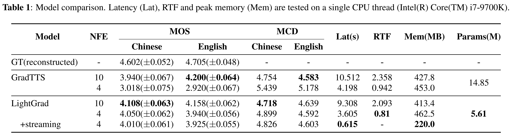

# Abstract

Recent advances in neural text-to-speech (TTS) models bring thousands of TTS applications into daily life, where models are deployed in cloud to provide services for customs.
Among these models are diffusion probabilistic models (DPMs), which can be stably trained and are more parameter-efficient compared with other generative models.
As transmitting data between customs and the cloud introduce high latency and the risk of exposing private data, deploying TTS models on edge devices is preferred.
When implementing DPMs onto edge devices, there are two practical problems.
First, current DPMs are not lightweight enough for resource-constrained devices.
Second, DPMs require many denoising steps in inference, which increases latency.
In this work, we present LightGrad, a lightweight DPM for TTS.
LightGrad is equipped with a lightweight U-Net diffusion decoder and a training-free fast sampling technique, reducing both model parameters and inference latency.
Streaming inference is also implemented in LightGrad to reduce latency further.
Compared with Grad-TTS, LightGrad achieves 62.2% reduction in paramters, 65.7% reduction in latency, while preserving comparable speech quality on both Chinese Mandarin and English in 4 denoising steps.

# Experiments
We evaluated LightGrad on both Chinese and English dataset.
For Chinese, we use [a public speech dataset](https://www.data-baker.com/open_source.html) containing 10,000 audio clips whose total length is nearly 12 hours.
Numbers of samples for training, validation and testing are 9,600, 200 and 200, respectively.
For English, we use LJSpeech containing 13,100 English audio clips, whose total length is nearly 24 hours.
Numbers of samples for training, validation and testing are 12,229, 348 and 523, respectively. 
Audios from both two datasets are resampled to 22,050Hz, and are converted to 80-dimensional mel-spectrograms with the frame size 1,024 and the hop size 256.

We select Grad-TTS as our baseline and follow its original setup.
Our LightGrad consists of an encoder, a duration predictor and a lightweight U-Net decoder.
The architecture of the encoder and the duration predictor is the same as Grad-TTS, but the encoder's hidden size and number of convolution channels in encoder are 128 and 512 respectively.
LightGrad is trained for 1.7M iterations on a single GPU with batch size 16, and Adam is chosen as the optimizer with learning rate 0.0001.
T for the forward process of LightGrad is set to 1, and we use the same noise schedule as Grad-TTS in LightGrad.
During inference, the temperature hyperparameter is set to 1.5 for both Grad-TTS and LightGrad.
We use the number of function evaluations (NFE, a.k.a number of denoising steps) to represent the number of calls to the decoder when sampling from DPM, and we set NFE for Grad-TTS and LightGrad to 4 and 10.
When LightGrad performs streaming inference, the decoder generates 0.5 second mel-spectrogram chunk each time.
HiFi-GAN is chosen as the vocoder converting mel-spectrograms to audios.

To evaluate the speech quality of LightGrad, we conducted a subjective test to compare LightGrad with other systems, including speeches reconstructed from ground truth mel-spectrogram (GT(reconstructed)) and Grad-TTS.
Mean opinion score (MOS) is selected as the evaluation metric of synthesized speeches.
To obtain MOS, for each model we randomly select 20 samples from test set and present them to 20 subjects in random order.
Subjects were asked to rate the quality of synthesized speech on a scale from 1 to 5 with 1 point increment in terms of naturalness, robustness and noise.
Audios that are more natural, have fewer pronunciation mistakes and less noise, are considered better.
We also conducted an objective evaluation using mel cepstral distortion (MCD).
Additionally, a runtime performance comparison between LightGrad and Grad-TTS is performed.
Average MCD, average latency, realtime factor (RTF) and runtime peak memory are calculated on the whole test set.

Experiment results are shown in Table.1.

### Demos from Chinese Dataset
In the following table, 10 synthesized sample pairs from the public Chinese speech dataset are provided.
* **Ground Truth (reconstructed)**: Speech reconstructed from ground truth mel-spectrogram.
* **Grad-TTS-10**: Speech synthesized by Grad-TTS whose NFE is 10 (10 steps for denoising).
* **LightGrad-10**: Speech synthesized by LightGrad whose NFE is 10  (10 steps for denoising).
* **Grad-TTS-4**: Speech synthesized by Grad-TTS whose NFE is 4 (4 steps for denoising).
* **LightGrad-4**: Speech synthesized by LightGrad whose NFE is 4 (4 steps for denoising).
* **LightGrad-4-Streaming**: Speech synthesized by LightGrad whose NFE is 4 (4 steps for denoising) with streaming inference.
<table>
    <thead>
        <tr>
            <th colspan='6' align='middle'>Text</th>
        </tr>
    </thead>
    <tbody>
        <tr>
            <td colspan='6' align='middle'>你看梁朝伟演色戒,刘嘉玲也得咬牙忍住呀.</td>
        </tr>
    </tbody>
    <thead>
        <tr>
            <th>Ground Truth (reconstructed)</th>
            <th>Grad-TTS-10</th>
            <th>LightGrad-10</th>
            <th>Grad-TTS-4</th>
            <th>LightGrad-4</th>
            <th>LightGrad-4-Streaming</th>
        </tr>
    </thead>
    <tbody>
        <tr>
            <td><audio src='demo/000122[GR]_gradtts.wav' controls></audio></td>
            <td><audio src='demo/000122[P]_grad_tts_bznsyp_prosody_10_original_gradtts.wav' controls></audio></td>
            <td><audio src='demo/000122[P]_slim_grad_v10_bznsyp_prosody_10_dpm_slimgradv10.wav' controls></audio></td>
            <td><audio src='demo/000122[P]_grad_tts_bznsyp_prosody_4_original_gradtts.wav' controls></audio></td>
            <td><audio src='demo/000122[P]_slim_grad_v10_bznsyp_prosody_4_dpm_slimgradv10.wav' controls></audio></td>
            <td><audio src='demo/000122[P]_slim_grad_v10_bznsyp_prosody_4_dpm_streaming_0.5_padding_slimgradv10.wav'
                    controls></audio></td>
        </tr>
    </tbody>
    <thead>
        <tr>
            <th colspan='6' align='middle'>Text</th>
        </tr>
    </thead>
    <tbody>
        <tr>
            <td colspan='6' align='middle'>面对这股勇猛的士气,师长牛七伟在感动之余格外镇静.</td>
        </tr>
    </tbody>
    <thead>
        <tr>
            <th>Ground Truth (reconstructed)</th>
            <th>Grad-TTS-10</th>
            <th>LightGrad-10</th>
            <th>Grad-TTS-4</th>
            <th>LightGrad-4</th>
            <th>LightGrad-4-Streaming</th>
        </tr>
    </thead>
    <tbody>
        <tr>
            <td><audio src='demo/001064[GR]_gradtts.wav' controls></audio></td>
            <td><audio src='demo/001064[P]_grad_tts_bznsyp_prosody_10_original_gradtts.wav' controls></audio></td>
            <td><audio src='demo/001064[P]_slim_grad_v10_bznsyp_prosody_10_dpm_slimgradv10.wav' controls></audio></td>
            <td><audio src='demo/001064[P]_grad_tts_bznsyp_prosody_4_original_gradtts.wav' controls></audio></td>
            <td><audio src='demo/001064[P]_slim_grad_v10_bznsyp_prosody_4_dpm_slimgradv10.wav' controls></audio></td>
            <td><audio src='demo/001064[P]_slim_grad_v10_bznsyp_prosody_4_dpm_streaming_0.5_padding_slimgradv10.wav'
                    controls></audio></td>
        </tr>
    </tbody>
    <thead>
        <tr>
            <th colspan='6' align='middle'>Text</th>
        </tr>
    </thead>
    <tbody>
        <tr>
            <td colspan='6' align='middle'>要不我们把预设方案上的敌情改一改?</td>
        </tr>
    </tbody>
    <thead>
        <tr>
            <th>Ground Truth (reconstructed)</th>
            <th>Grad-TTS-10</th>
            <th>LightGrad-10</th>
            <th>Grad-TTS-4</th>
            <th>LightGrad-4</th>
            <th>LightGrad-4-Streaming</th>
        </tr>
    </thead>
    <tbody>
        <tr>
            <td><audio src='demo/001134[GR]_gradtts.wav' controls></audio></td>
            <td><audio src='demo/001134[P]_grad_tts_bznsyp_prosody_10_original_gradtts.wav' controls></audio></td>
            <td><audio src='demo/001134[P]_slim_grad_v10_bznsyp_prosody_10_dpm_slimgradv10.wav' controls></audio></td>
            <td><audio src='demo/001134[P]_grad_tts_bznsyp_prosody_4_original_gradtts.wav' controls></audio></td>
            <td><audio src='demo/001134[P]_slim_grad_v10_bznsyp_prosody_4_dpm_slimgradv10.wav' controls></audio></td>
            <td><audio src='demo/001134[P]_slim_grad_v10_bznsyp_prosody_4_dpm_streaming_0.5_padding_slimgradv10.wav'
                    controls></audio></td>
        </tr>
    </tbody>
    <thead>
        <tr>
            <th colspan='6' align='middle'>Text</th>
        </tr>
    </thead>
    <tbody>
        <tr>
            <td colspan='6' align='middle'>这些聋哑人只有乖乖就范.</td>
        </tr>
    </tbody>
    <thead>
        <tr>
            <th>Ground Truth (reconstructed)</th>
            <th>Grad-TTS-10</th>
            <th>LightGrad-10</th>
            <th>Grad-TTS-4</th>
            <th>LightGrad-4</th>
            <th>LightGrad-4-Streaming</th>
        </tr>
    </thead>
    <tbody>
        <tr>
            <td><audio src='demo/001136[GR]_gradtts.wav' controls></audio></td>
            <td><audio src='demo/001136[P]_grad_tts_bznsyp_prosody_10_original_gradtts.wav' controls></audio></td>
            <td><audio src='demo/001136[P]_slim_grad_v10_bznsyp_prosody_10_dpm_slimgradv10.wav' controls></audio></td>
            <td><audio src='demo/001136[P]_grad_tts_bznsyp_prosody_4_original_gradtts.wav' controls></audio></td>
            <td><audio src='demo/001136[P]_slim_grad_v10_bznsyp_prosody_4_dpm_slimgradv10.wav' controls></audio></td>
            <td><audio src='demo/001136[P]_slim_grad_v10_bznsyp_prosody_4_dpm_streaming_0.5_padding_slimgradv10.wav'
                    controls></audio></td>
        </tr>
    </tbody>
    <thead>
        <tr>
            <th colspan='6' align='middle'>Text</th>
        </tr>
    </thead>
    <tbody>
        <tr>
            <td colspan='6' align='middle'>四百块钱,不花这四百,你永远挂不上号.</td>
        </tr>
    </tbody>
    <thead>
        <tr>
            <th>Ground Truth (reconstructed)</th>
            <th>Grad-TTS-10</th>
            <th>LightGrad-10</th>
            <th>Grad-TTS-4</th>
            <th>LightGrad-4</th>
            <th>LightGrad-4-Streaming</th>
        </tr>
    </thead>
    <tbody>
        <tr>
            <td><audio src='demo/001470[GR]_gradtts.wav' controls></audio></td>
            <td><audio src='demo/001470[P]_grad_tts_bznsyp_prosody_10_original_gradtts.wav' controls></audio></td>
            <td><audio src='demo/001470[P]_slim_grad_v10_bznsyp_prosody_10_dpm_slimgradv10.wav' controls></audio></td>
            <td><audio src='demo/001470[P]_grad_tts_bznsyp_prosody_4_original_gradtts.wav' controls></audio></td>
            <td><audio src='demo/001470[P]_slim_grad_v10_bznsyp_prosody_4_dpm_slimgradv10.wav' controls></audio></td>
            <td><audio src='demo/001470[P]_slim_grad_v10_bznsyp_prosody_4_dpm_streaming_0.5_padding_slimgradv10.wav'
                    controls></audio></td>
        </tr>
    </tbody>
    <thead>
        <tr>
            <th colspan='6' align='middle'>Text</th>
        </tr>
    </thead>
    <tbody>
        <tr>
            <td colspan='6' align='middle'>朱好龙摸了摸水牛,水牛乖乖睡了下来.</td>
        </tr>
    </tbody>
    <thead>
        <tr>
            <th>Ground Truth (reconstructed)</th>
            <th>Grad-TTS-10</th>
            <th>LightGrad-10</th>
            <th>Grad-TTS-4</th>
            <th>LightGrad-4</th>
            <th>LightGrad-4-Streaming</th>
        </tr>
    </thead>
    <tbody>
        <tr>
            <td><audio src='demo/001520[GR]_gradtts.wav' controls></audio></td>
            <td><audio src='demo/001520[P]_grad_tts_bznsyp_prosody_10_original_gradtts.wav' controls></audio></td>
            <td><audio src='demo/001520[P]_slim_grad_v10_bznsyp_prosody_10_dpm_slimgradv10.wav' controls></audio></td>
            <td><audio src='demo/001520[P]_grad_tts_bznsyp_prosody_4_original_gradtts.wav' controls></audio></td>
            <td><audio src='demo/001520[P]_slim_grad_v10_bznsyp_prosody_4_dpm_slimgradv10.wav' controls></audio></td>
            <td><audio src='demo/001520[P]_slim_grad_v10_bznsyp_prosody_4_dpm_streaming_0.5_padding_slimgradv10.wav'
                    controls></audio></td>
        </tr>
    </tbody>
    <thead>
        <tr>
            <th colspan='6' align='middle'>Text</th>
        </tr>
    </thead>
    <tbody>
        <tr>
            <td colspan='6' align='middle'>红圈处是设在鱼塘边的赌场.</td>
        </tr>
    </tbody>
    <thead>
        <tr>
            <th>Ground Truth (reconstructed)</th>
            <th>Grad-TTS-10</th>
            <th>LightGrad-10</th>
            <th>Grad-TTS-4</th>
            <th>LightGrad-4</th>
            <th>LightGrad-4-Streaming</th>
        </tr>
    </thead>
    <tbody>
        <tr>
            <td><audio src='demo/002093[GR]_gradtts.wav' controls></audio></td>
            <td><audio src='demo/002093[P]_grad_tts_bznsyp_prosody_10_original_gradtts.wav' controls></audio></td>
            <td><audio src='demo/002093[P]_slim_grad_v10_bznsyp_prosody_10_dpm_slimgradv10.wav' controls></audio></td>
            <td><audio src='demo/002093[P]_grad_tts_bznsyp_prosody_4_original_gradtts.wav' controls></audio></td>
            <td><audio src='demo/002093[P]_slim_grad_v10_bznsyp_prosody_4_dpm_slimgradv10.wav' controls></audio></td>
            <td><audio src='demo/002093[P]_slim_grad_v10_bznsyp_prosody_4_dpm_streaming_0.5_padding_slimgradv10.wav'
                    controls></audio></td>
        </tr>
    </tbody>
    <thead>
        <tr>
            <th colspan='6' align='middle'>Text</th>
        </tr>
    </thead>
    <tbody>
        <tr>
            <td colspan='6' align='middle'>我的闺蜜们一口咬定我是犯了花痴,看中了主人的帅气模样.</td>
        </tr>
    </tbody>
    <thead>
        <tr>
            <th>Ground Truth (reconstructed)</th>
            <th>Grad-TTS-10</th>
            <th>LightGrad-10</th>
            <th>Grad-TTS-4</th>
            <th>LightGrad-4</th>
            <th>LightGrad-4-Streaming</th>
        </tr>
    </thead>
    <tbody>
        <tr>
            <td><audio src='demo/004349[GR]_gradtts.wav' controls></audio></td>
            <td><audio src='demo/004349[P]_grad_tts_bznsyp_prosody_10_original_gradtts.wav' controls></audio></td>
            <td><audio src='demo/004349[P]_slim_grad_v10_bznsyp_prosody_10_dpm_slimgradv10.wav' controls></audio></td>
            <td><audio src='demo/004349[P]_grad_tts_bznsyp_prosody_4_original_gradtts.wav' controls></audio></td>
            <td><audio src='demo/004349[P]_slim_grad_v10_bznsyp_prosody_4_dpm_slimgradv10.wav' controls></audio></td>
            <td><audio src='demo/004349[P]_slim_grad_v10_bznsyp_prosody_4_dpm_streaming_0.5_padding_slimgradv10.wav'
                    controls></audio></td>
        </tr>
    </tbody>
    <thead>
        <tr>
            <th colspan='6' align='middle'>Text</th>
        </tr>
    </thead>
    <tbody>
        <tr>
            <td colspan='6' align='middle'>庭审时,两被告人在捂嘴咳嗽.</td>
        </tr>
    </tbody>
    <thead>
        <tr>
            <th>Ground Truth (reconstructed)</th>
            <th>Grad-TTS-10</th>
            <th>LightGrad-10</th>
            <th>Grad-TTS-4</th>
            <th>LightGrad-4</th>
            <th>LightGrad-4-Streaming</th>
        </tr>
    </thead>
    <tbody>
        <tr>
            <td><audio src='demo/004506[GR]_gradtts.wav' controls></audio></td>
            <td><audio src='demo/004506[P]_grad_tts_bznsyp_prosody_10_original_gradtts.wav' controls></audio></td>
            <td><audio src='demo/004506[P]_slim_grad_v10_bznsyp_prosody_10_dpm_slimgradv10.wav' controls></audio></td>
            <td><audio src='demo/004506[P]_grad_tts_bznsyp_prosody_4_original_gradtts.wav' controls></audio></td>
            <td><audio src='demo/004506[P]_slim_grad_v10_bznsyp_prosody_4_dpm_slimgradv10.wav' controls></audio></td>
            <td><audio src='demo/004506[P]_slim_grad_v10_bznsyp_prosody_4_dpm_streaming_0.5_padding_slimgradv10.wav'
                    controls></audio></td>
        </tr>
    </tbody>
    <thead>
        <tr>
            <th colspan='6' align='middle'>Text</th>
        </tr>
    </thead>
    <tbody>
        <tr>
            <td colspan='6' align='middle'>但阿灵顿现在却声称,她当初离职时处于极其肮脏的状况.</td>
        </tr>
    </tbody>
    <thead>
        <tr>
            <th>Ground Truth (reconstructed)</th>
            <th>Grad-TTS-10</th>
            <th>LightGrad-10</th>
            <th>Grad-TTS-4</th>
            <th>LightGrad-4</th>
            <th>LightGrad-4-Streaming</th>
        </tr>
    </thead>
    <tbody>
        <tr>
            <td><audio src='demo/006375[GR]_gradtts.wav' controls></audio></td>
            <td><audio src='demo/006375[P]_grad_tts_bznsyp_prosody_10_original_gradtts.wav' controls></audio></td>
            <td><audio src='demo/006375[P]_slim_grad_v10_bznsyp_prosody_10_dpm_slimgradv10.wav' controls></audio></td>
            <td><audio src='demo/006375[P]_grad_tts_bznsyp_prosody_4_original_gradtts.wav' controls></audio></td>
            <td><audio src='demo/006375[P]_slim_grad_v10_bznsyp_prosody_4_dpm_slimgradv10.wav' controls></audio></td>
            <td><audio src='demo/006375[P]_slim_grad_v10_bznsyp_prosody_4_dpm_streaming_0.5_padding_slimgradv10.wav'
                    controls></audio></td>
        </tr>
    </tbody>
</table>

### Demos from English Dataset
In the following table, 10 synthesized sample pairs from LJSpeech are provided.
* **Ground Truth (reconstructed)**: Speech reconstructed from ground truth mel-spectrogram.
* **Grad-TTS-10**: Speech synthesized by Grad-TTS whose NFE is 10 (10 steps for denoising).
* **LightGrad-10**: Speech synthesized by LightGrad whose NFE is 10  (10 steps for denoising).
* **Grad-TTS-4**: Speech synthesized by Grad-TTS whose NFE is 4 (4 steps for denoising).
* **LightGrad-4**: Speech synthesized by LightGrad whose NFE is 4 (4 steps for denoising).
* **LightGrad-4-Streaming**: Speech synthesized by LightGrad whose NFE is 4 (4 steps for denoising) with streaming inference.

<table>
    <thead>
        <tr>
            <th colspan='6' align='middle'>Text</th>
        </tr>
    </thead>
    <tbody>
        <tr>
            <td colspan='6' align='middle'>after his death in the fourteen eighties , or at least by fourteen ninety ,
                printing in venice had declined very much ;</td>
        </tr>
    </tbody>
    <thead>
        <tr>
            <th>Ground Truth (reconstructed)</th>
            <th>Grad-TTS-10</th>
            <th>LightGrad-10</th>
            <th>Grad-TTS-4</th>
            <th>LightGrad-4</th>
            <th>LightGrad-4-Streaming</th>
        </tr>
    </thead>
    <tbody>
        <tr>
            <td><audio src='demo/LJ001-0049[GR]_gradtts.wav' controls></audio></td>
            <td><audio src='demo/LJ001-0049[P]_grad_tts_ljspeech_10_original_gradtts.wav' controls></audio></td>
            <td><audio src='demo/LJ001-0049[P]_slim_grad_v10_ljspeech_10_dpm_slimgradv10.wav' controls></audio></td>
            <td><audio src='demo/LJ001-0049[P]_grad_tts_ljspeech_4_original_gradtts.wav' controls></audio></td>
            <td><audio src='demo/LJ001-0049[P]_slim_grad_v10_ljspeech_4_dpm_slimgradv10.wav' controls></audio></td>
            <td><audio src='demo/LJ001-0049[P]_slim_grad_v10_ljspeech_4_dpm_streaming_0.5_padding_slimgradv10.wav'
                    controls></audio></td>
        </tr>
    </tbody>
    <thead>
        <tr>
            <th colspan='6' align='middle'>Text</th>
        </tr>
    </thead>
    <tbody>
        <tr>
            <td colspan='6' align='middle'>yet their type is artistically on a much lower level than jensons , and in
                fact</td>
        </tr>
    </tbody>
    <thead>
        <tr>
            <th>Ground Truth (reconstructed)</th>
            <th>Grad-TTS-10</th>
            <th>LightGrad-10</th>
            <th>Grad-TTS-4</th>
            <th>LightGrad-4</th>
            <th>LightGrad-4-Streaming</th>
        </tr>
    </thead>
    <tbody>
        <tr>
            <td><audio src='demo/LJ001-0052[GR]_gradtts.wav' controls></audio></td>
            <td><audio src='demo/LJ001-0052[P]_grad_tts_ljspeech_10_original_gradtts.wav' controls></audio></td>
            <td><audio src='demo/LJ001-0052[P]_slim_grad_v10_ljspeech_10_dpm_slimgradv10.wav' controls></audio></td>
            <td><audio src='demo/LJ001-0052[P]_grad_tts_ljspeech_4_original_gradtts.wav' controls></audio></td>
            <td><audio src='demo/LJ001-0052[P]_slim_grad_v10_ljspeech_4_dpm_slimgradv10.wav' controls></audio></td>
            <td><audio src='demo/LJ001-0052[P]_slim_grad_v10_ljspeech_4_dpm_streaming_0.5_padding_slimgradv10.wav'
                    controls></audio></td>
        </tr>
    </tbody>
    <thead>
        <tr>
            <th colspan='6' align='middle'>Text</th>
        </tr>
    </thead>
    <tbody>
        <tr>
            <td colspan='6' align='middle'>and these somewhat wiry letters are suitable for the machine process , which
                would not do justice to letters of more generous design .</td>
        </tr>
    </tbody>
    <thead>
        <tr>
            <th>Ground Truth (reconstructed)</th>
            <th>Grad-TTS-10</th>
            <th>LightGrad-10</th>
            <th>Grad-TTS-4</th>
            <th>LightGrad-4</th>
            <th>LightGrad-4-Streaming</th>
        </tr>
    </thead>
    <tbody>
        <tr>
            <td><audio src='demo/LJ001-0100[GR]_gradtts.wav' controls></audio></td>
            <td><audio src='demo/LJ001-0100[P]_grad_tts_ljspeech_10_original_gradtts.wav' controls></audio></td>
            <td><audio src='demo/LJ001-0100[P]_slim_grad_v10_ljspeech_10_dpm_slimgradv10.wav' controls></audio></td>
            <td><audio src='demo/LJ001-0100[P]_grad_tts_ljspeech_4_original_gradtts.wav' controls></audio></td>
            <td><audio src='demo/LJ001-0100[P]_slim_grad_v10_ljspeech_4_dpm_slimgradv10.wav' controls></audio></td>
            <td><audio src='demo/LJ001-0100[P]_slim_grad_v10_ljspeech_4_dpm_streaming_0.5_padding_slimgradv10.wav'
                    controls></audio></td>
        </tr>
    </tbody>
    <thead>
        <tr>
            <th colspan='6' align='middle'>Text</th>
        </tr>
    </thead>
    <tbody>
        <tr>
            <td colspan='6' align='middle'>in reading the modern figures the eyes must be strained before the reader can
                have any reasonable assurance</td>
        </tr>
    </tbody>
    <thead>
        <tr>
            <th>Ground Truth (reconstructed)</th>
            <th>Grad-TTS-10</th>
            <th>LightGrad-10</th>
            <th>Grad-TTS-4</th>
            <th>LightGrad-4</th>
            <th>LightGrad-4-Streaming</th>
        </tr>
    </thead>
    <tbody>
        <tr>
            <td><audio src='demo/LJ001-0121[GR]_gradtts.wav' controls></audio></td>
            <td><audio src='demo/LJ001-0121[P]_grad_tts_ljspeech_10_original_gradtts.wav' controls></audio></td>
            <td><audio src='demo/LJ001-0121[P]_slim_grad_v10_ljspeech_10_dpm_slimgradv10.wav' controls></audio></td>
            <td><audio src='demo/LJ001-0121[P]_grad_tts_ljspeech_4_original_gradtts.wav' controls></audio></td>
            <td><audio src='demo/LJ001-0121[P]_slim_grad_v10_ljspeech_4_dpm_slimgradv10.wav' controls></audio></td>
            <td><audio src='demo/LJ001-0121[P]_slim_grad_v10_ljspeech_4_dpm_streaming_0.5_padding_slimgradv10.wav'
                    controls></audio></td>
        </tr>
    </tbody>
    <thead>
        <tr>
            <th colspan='6' align='middle'>Text</th>
        </tr>
    </thead>
    <tbody>
        <tr>
            <td colspan='6' align='middle'>for where these are boldly and carefully designed , and each letter is
                thoroughly individual in form ,</td>
        </tr>
    </tbody>
    <thead>
        <tr>
            <th>Ground Truth (reconstructed)</th>
            <th>Grad-TTS-10</th>
            <th>LightGrad-10</th>
            <th>Grad-TTS-4</th>
            <th>LightGrad-4</th>
            <th>LightGrad-4-Streaming</th>
        </tr>
    </thead>
    <tbody>
        <tr>
            <td><audio src='demo/LJ001-0143[GR]_gradtts.wav' controls></audio></td>
            <td><audio src='demo/LJ001-0143[P]_grad_tts_ljspeech_10_original_gradtts.wav' controls></audio></td>
            <td><audio src='demo/LJ001-0143[P]_slim_grad_v10_ljspeech_10_dpm_slimgradv10.wav' controls></audio></td>
            <td><audio src='demo/LJ001-0143[P]_grad_tts_ljspeech_4_original_gradtts.wav' controls></audio></td>
            <td><audio src='demo/LJ001-0143[P]_slim_grad_v10_ljspeech_4_dpm_slimgradv10.wav' controls></audio></td>
            <td><audio src='demo/LJ001-0143[P]_slim_grad_v10_ljspeech_4_dpm_streaming_0.5_padding_slimgradv10.wav'
                    controls></audio></td>
        </tr>
    </tbody>
    <thead>
        <tr>
            <th colspan='6' align='middle'>Text</th>
        </tr>
    </thead>
    <tbody>
        <tr>
            <td colspan='6' align='middle'>the words may be set much closer together , without loss of clearness .</td>
        </tr>
    </tbody>
    <thead>
        <tr>
            <th>Ground Truth (reconstructed)</th>
            <th>Grad-TTS-10</th>
            <th>LightGrad-10</th>
            <th>Grad-TTS-4</th>
            <th>LightGrad-4</th>
            <th>LightGrad-4-Streaming</th>
        </tr>
    </thead>
    <tbody>
        <tr>
            <td><audio src='demo/LJ001-0144[GR]_gradtts.wav' controls></audio></td>
            <td><audio src='demo/LJ001-0144[P]_grad_tts_ljspeech_10_original_gradtts.wav' controls></audio></td>
            <td><audio src='demo/LJ001-0144[P]_slim_grad_v10_ljspeech_10_dpm_slimgradv10.wav' controls></audio></td>
            <td><audio src='demo/LJ001-0144[P]_grad_tts_ljspeech_4_original_gradtts.wav' controls></audio></td>
            <td><audio src='demo/LJ001-0144[P]_slim_grad_v10_ljspeech_4_dpm_slimgradv10.wav' controls></audio></td>
            <td><audio src='demo/LJ001-0144[P]_slim_grad_v10_ljspeech_4_dpm_streaming_0.5_padding_slimgradv10.wav'
                    controls></audio></td>
        </tr>
    </tbody>
    <thead>
        <tr>
            <th colspan='6' align='middle'>Text</th>
        </tr>
    </thead>
    <tbody>
        <tr>
            <td colspan='6' align='middle'>the paper on which the printing is to be done is a necessary part of our
                subject :</td>
        </tr>
    </tbody>
    <thead>
        <tr>
            <th>Ground Truth (reconstructed)</th>
            <th>Grad-TTS-10</th>
            <th>LightGrad-10</th>
            <th>Grad-TTS-4</th>
            <th>LightGrad-4</th>
            <th>LightGrad-4-Streaming</th>
        </tr>
    </thead>
    <tbody>
        <tr>
            <td><audio src='demo/LJ001-0156[GR]_gradtts.wav' controls></audio></td>
            <td><audio src='demo/LJ001-0156[P]_grad_tts_ljspeech_10_original_gradtts.wav' controls></audio></td>
            <td><audio src='demo/LJ001-0156[P]_slim_grad_v10_ljspeech_10_dpm_slimgradv10.wav' controls></audio></td>
            <td><audio src='demo/LJ001-0156[P]_grad_tts_ljspeech_4_original_gradtts.wav' controls></audio></td>
            <td><audio src='demo/LJ001-0156[P]_slim_grad_v10_ljspeech_4_dpm_slimgradv10.wav' controls></audio></td>
            <td><audio src='demo/LJ001-0156[P]_slim_grad_v10_ljspeech_4_dpm_streaming_0.5_padding_slimgradv10.wav'
                    controls></audio></td>
        </tr>
    </tbody>
    <thead>
        <tr>
            <th colspan='6' align='middle'>Text</th>
        </tr>
    </thead>
    <tbody>
        <tr>
            <td colspan='6' align='middle'>the master felons side consisted of a yard the same size as the preceding ,
                appropriated nominally to the most decent and better behaved prisoners ,</td>
        </tr>
    </tbody>
    <thead>
        <tr>
            <th>Ground Truth (reconstructed)</th>
            <th>Grad-TTS-10</th>
            <th>LightGrad-10</th>
            <th>Grad-TTS-4</th>
            <th>LightGrad-4</th>
            <th>LightGrad-4-Streaming</th>
        </tr>
    </thead>
    <tbody>
        <tr>
            <td><audio src='demo/LJ002-0066[GR]_gradtts.wav' controls></audio></td>
            <td><audio src='demo/LJ002-0066[P]_grad_tts_ljspeech_10_original_gradtts.wav' controls></audio></td>
            <td><audio src='demo/LJ002-0066[P]_slim_grad_v10_ljspeech_10_dpm_slimgradv10.wav' controls></audio></td>
            <td><audio src='demo/LJ002-0066[P]_grad_tts_ljspeech_4_original_gradtts.wav' controls></audio></td>
            <td><audio src='demo/LJ002-0066[P]_slim_grad_v10_ljspeech_4_dpm_slimgradv10.wav' controls></audio></td>
            <td><audio src='demo/LJ002-0066[P]_slim_grad_v10_ljspeech_4_dpm_streaming_0.5_padding_slimgradv10.wav'
                    controls></audio></td>
        </tr>
    </tbody>
    <thead>
        <tr>
            <th colspan='6' align='middle'>Text</th>
        </tr>
    </thead>
    <tbody>
        <tr>
            <td colspan='6' align='middle'>and the rest being provided with barrack beds , and in dimensions varying
                from thirty feet by fifteen to fifteen feet by ten .</td>
        </tr>
    </tbody>
    <thead>
        <tr>
            <th>Ground Truth (reconstructed)</th>
            <th>Grad-TTS-10</th>
            <th>LightGrad-10</th>
            <th>Grad-TTS-4</th>
            <th>LightGrad-4</th>
            <th>LightGrad-4-Streaming</th>
        </tr>
    </thead>
    <tbody>
        <tr>
            <td><audio src='demo/LJ002-0095[GR]_gradtts.wav' controls></audio></td>
            <td><audio src='demo/LJ002-0095[P]_grad_tts_ljspeech_10_original_gradtts.wav' controls></audio></td>
            <td><audio src='demo/LJ002-0095[P]_slim_grad_v10_ljspeech_10_dpm_slimgradv10.wav' controls></audio></td>
            <td><audio src='demo/LJ002-0095[P]_grad_tts_ljspeech_4_original_gradtts.wav' controls></audio></td>
            <td><audio src='demo/LJ002-0095[P]_slim_grad_v10_ljspeech_4_dpm_slimgradv10.wav' controls></audio></td>
            <td><audio src='demo/LJ002-0095[P]_slim_grad_v10_ljspeech_4_dpm_streaming_0.5_padding_slimgradv10.wav'
                    controls></audio></td>
        </tr>
    </tbody>
    <thead>
        <tr>
            <th colspan='6' align='middle'>Text</th>
        </tr>
    </thead>
    <tbody>
        <tr>
            <td colspan='6' align='middle'>the state of morals was disgraceful . any woman obtained admission if sober ,
                and if she got drunk she was not turned out .</td>
        </tr>
    </tbody>
    <thead>
        <tr>
            <th>Ground Truth (reconstructed)</th>
            <th>Grad-TTS-10</th>
            <th>LightGrad-10</th>
            <th>Grad-TTS-4</th>
            <th>LightGrad-4</th>
            <th>LightGrad-4-Streaming</th>
        </tr>
    </thead>
    <tbody>
        <tr>
            <td><audio src='demo/LJ002-0230[GR]_gradtts.wav' controls></audio></td>
            <td><audio src='demo/LJ002-0230[P]_grad_tts_ljspeech_10_original_gradtts.wav' controls></audio></td>
            <td><audio src='demo/LJ002-0230[P]_slim_grad_v10_ljspeech_10_dpm_slimgradv10.wav' controls></audio></td>
            <td><audio src='demo/LJ002-0230[P]_grad_tts_ljspeech_4_original_gradtts.wav' controls></audio></td>
            <td><audio src='demo/LJ002-0230[P]_slim_grad_v10_ljspeech_4_dpm_slimgradv10.wav' controls></audio></td>
            <td><audio src='demo/LJ002-0230[P]_slim_grad_v10_ljspeech_4_dpm_streaming_0.5_padding_slimgradv10.wav'
                    controls></audio></td>
        </tr>
    </tbody>
</table>

# Ablation Study
To show the effectiveness of designs in LightGrad, ablation studies are conducted, where 20 subjects were asked to rate the comparison mean opinion score (CMOS) for 20 samples from test set in terms of naturalness, robustness and noise on both Chinese and English dataset.
To validate the effectiveness of lightweight U-Net, we replace it with a different decoder composed of four feed-forward Transformer (FFT) block having roughly the same number of parameters as lightweight U-Net.
We also substitute the fast sampling technique in LightGrad with the original sampling method in Grad-TTS to show benefits of the fast sampling technique.
NFE for all diffusion models in ablation studies is set to 4.

### Demos from on Chinese Dataset
In the following table, 6 synthesized sample pairs from the public Chinese speech dataset are provided.
* **LightGrad-4**: Speech synthesized by LightGrad whose NFE is 4 (4 steps for denoising).
* **w/o diffusion**: Speech synthesized by LightGrad with a different decoder composed of four feed-forward Transformer block having roughly the same number of parameters as lightweight U-Net.
* **w/o fastsampling**: Speech synthesized by LightGrad whose NFE is 4 (4 steps for denoising) with the original sampling method in Grad-TTS.

<table>
    <thead>
        <tr>
            <th colspan='3' align='middle'>Text</th>
        </tr>
    </thead>
    <tbody>
        <tr>
            <td colspan='3' align='middle'>你看梁朝伟演色戒,刘嘉玲也得咬牙忍住呀.</td>
        </tr>
    </tbody>
    <thead>
        <tr>
            <th>LightGrad-4</th>
            <th>w/o diffusion</th>
            <th>w/o fast sampling</th>
        </tr>
    </thead>
    <tbody>
        <tr>
            <td><audio src='demo/000122[P]_slim_grad_v10_bznsyp_prosody_4_dpm_slimgradv10.wav' controls></audio></td>
            <td><audio src='demo/000122_predicted_bznsyp_prosody_slim_transformer.wav' controls></audio></td>
            <td><audio src='demo/000122[P]_slim_grad_v10_bznsyp_prosody_4_original_slimgradv10original.wav'
                    controls></audio></td>
        </tr>
    </tbody>
    <thead>
        <tr>
            <th colspan='3' align='middle'>Text</th>
        </tr>
    </thead>
    <tbody>
        <tr>
            <td colspan='3' align='middle'>这些聋哑人只有乖乖就范.</td>
        </tr>
    </tbody>
    <thead>
        <tr>
            <th>LightGrad-4</th>
            <th>w/o diffusion</th>
            <th>w/o fast sampling</th>
        </tr>
    </thead>
    <tbody>
        <tr>
            <td><audio src='demo/001136[P]_slim_grad_v10_bznsyp_prosody_4_dpm_slimgradv10.wav' controls></audio></td>
            <td><audio src='demo/001136_predicted_bznsyp_prosody_slim_transformer.wav' controls></audio></td>
            <td><audio src='demo/001136[P]_slim_grad_v10_bznsyp_prosody_4_original_slimgradv10original.wav'
                    controls></audio></td>
        </tr>
    </tbody>
    <thead>
        <tr>
            <th colspan='3' align='middle'>Text</th>
        </tr>
    </thead>
    <tbody>
        <tr>
            <td colspan='3' align='middle'>四百块钱,不花这四百,你永远挂不上号.</td>
        </tr>
    </tbody>
    <thead>
        <tr>
            <th>LightGrad-4</th>
            <th>w/o diffusion</th>
            <th>w/o fast sampling</th>
        </tr>
    </thead>
    <tbody>
        <tr>
            <td><audio src='demo/001470[P]_slim_grad_v10_bznsyp_prosody_4_dpm_slimgradv10.wav' controls></audio></td>
            <td><audio src='demo/001470_predicted_bznsyp_prosody_slim_transformer.wav' controls></audio></td>
            <td><audio src='demo/001470[P]_slim_grad_v10_bznsyp_prosody_4_original_slimgradv10original.wav'
                    controls></audio></td>
        </tr>
    </tbody>
    <thead>
        <tr>
            <th colspan='3' align='middle'>Text</th>
        </tr>
    </thead>
    <tbody>
        <tr>
            <td colspan='3' align='middle'>我的闺蜜们一口咬定我是犯了花痴,看中了主人的帅气模样.</td>
        </tr>
    </tbody>
    <thead>
        <tr>
            <th>LightGrad-4</th>
            <th>w/o diffusion</th>
            <th>w/o fast sampling</th>
        </tr>
    </thead>
    <tbody>
        <tr>
            <td><audio src='demo/004349[P]_slim_grad_v10_bznsyp_prosody_4_dpm_slimgradv10.wav' controls></audio></td>
            <td><audio src='demo/004349_predicted_bznsyp_prosody_slim_transformer.wav' controls></audio></td>
            <td><audio src='demo/004349[P]_slim_grad_v10_bznsyp_prosody_4_original_slimgradv10original.wav'
                    controls></audio></td>
        </tr>
    </tbody>
    <thead>
        <tr>
            <th colspan='3' align='middle'>Text</th>
        </tr>
    </thead>
    <tbody>
        <tr>
            <td colspan='3' align='middle'>但阿灵顿现在却声称,她当初离职时处于极其肮脏的状况.</td>
        </tr>
    </tbody>
    <thead>
        <tr>
            <th>LightGrad-4</th>
            <th>w/o diffusion</th>
            <th>w/o fast sampling</th>
        </tr>
    </thead>
    <tbody>
        <tr>
            <td><audio src='demo/006375[P]_slim_grad_v10_bznsyp_prosody_4_dpm_slimgradv10.wav' controls></audio></td>
            <td><audio src='demo/006375_predicted_bznsyp_prosody_slim_transformer.wav' controls></audio></td>
            <td><audio src='demo/006375[P]_slim_grad_v10_bznsyp_prosody_4_original_slimgradv10original.wav'
                    controls></audio></td>
        </tr>
    </tbody>
    <thead>
        <tr>
            <th colspan='3' align='middle'>Text</th>
        </tr>
    </thead>
    <tbody>
        <tr>
            <td colspan='3' align='middle'>是全党全国各族人民团结奋斗的旗帜?</td>
        </tr>
    </tbody>
    <thead>
        <tr>
            <th>LightGrad-4</th>
            <th>w/o diffusion</th>
            <th>w/o fast sampling</th>
        </tr>
    </thead>
    <tbody>
        <tr>
            <td><audio src='demo/007773[P]_slim_grad_v10_bznsyp_prosody_4_dpm_slimgradv10.wav' controls></audio></td>
            <td><audio src='demo/007773_predicted_bznsyp_prosody_slim_transformer.wav' controls></audio></td>
            <td><audio src='demo/007773[P]_slim_grad_v10_bznsyp_prosody_4_original_slimgradv10original.wav'
                    controls></audio></td>
        </tr>
    </tbody>
</table>

### Demos from English Dataset
In the following table, 6 synthesized sample pairs from LJSpeech dataset are provided.
* **LightGrad-4**: Speech synthesized by LightGrad whose NFE is 4 (4 steps for denoising).
* **w/o diffusion**: Speech synthesized by LightGrad with a different decoder composed of four feed-forward Transformer block having roughly the same number of parameters as lightweight U-Net.
* **w/o fastsampling**: Speech synthesized by LightGrad whose NFE is 4 (4 steps for denoising) with the original sampling method in Grad-TTS.

<table>
    <thead>
        <tr>
            <th colspan='3' align='middle'>Text</th>
        </tr>
    </thead>
    <tbody>
        <tr>
            <td colspan='3' align='middle'>that the forms of printed letters should follow more or less closely those of
                the written character , and they followed them very closely .</td>
        </tr>
    </tbody>
    <thead>
        <tr>
            <th>LightGrad-4</th>
            <th>w/o diffusion</th>
            <th>w/o fast sampling</th>
        </tr>
    </thead>
    <tbody>
        <tr>
            <td><audio src='demo/LJ001-0017[P]_slim_grad_v10_ljspeech_4_dpm_slimgradv10.wav' controls></audio></td>
            <td><audio src='demo/LJ001-0017_predicted_ljspeech_slim_transformer.wav' controls></audio></td>
            <td><audio src='demo/LJ001-0017[P]_slim_grad_v10_ljspeech_4_original_slimgradv10original.wav'
                    controls></audio></td>
        </tr>
    </tbody>
    <thead>
        <tr>
            <th colspan='3' align='middle'>Text</th>
        </tr>
    </thead>
    <tbody>
        <tr>
            <td colspan='3' align='middle'>after his death in the fourteen eighties , or at least by fourteen ninety ,
                printing in venice had declined very much ;</td>
        </tr>
    </tbody>
    <thead>
        <tr>
            <th>LightGrad-4</th>
            <th>w/o diffusion</th>
            <th>w/o fast sampling</th>
        </tr>
    </thead>
    <tbody>
        <tr>
            <td><audio src='demo/LJ001-0049[P]_slim_grad_v10_ljspeech_4_dpm_slimgradv10.wav' controls></audio></td>
            <td><audio src='demo/LJ001-0049_predicted_ljspeech_slim_transformer.wav' controls></audio></td>
            <td><audio src='demo/LJ001-0049[P]_slim_grad_v10_ljspeech_4_original_slimgradv10original.wav'
                    controls></audio></td>
        </tr>
    </tbody>
    <thead>
        <tr>
            <th colspan='3' align='middle'>Text</th>
        </tr>
    </thead>
    <tbody>
        <tr>
            <td colspan='3' align='middle'>yet their type is artistically on a much lower level than jensons , and in
                fact</td>
        </tr>
    </tbody>
    <thead>
        <tr>
            <th>LightGrad-4</th>
            <th>w/o diffusion</th>
            <th>w/o fast sampling</th>
        </tr>
    </thead>
    <tbody>
        <tr>
            <td><audio src='demo/LJ001-0052[P]_slim_grad_v10_ljspeech_4_dpm_slimgradv10.wav' controls></audio></td>
            <td><audio src='demo/LJ001-0052_predicted_ljspeech_slim_transformer.wav' controls></audio></td>
            <td><audio src='demo/LJ001-0052[P]_slim_grad_v10_ljspeech_4_original_slimgradv10original.wav'
                    controls></audio></td>
        </tr>
    </tbody>
    <thead>
        <tr>
            <th colspan='3' align='middle'>Text</th>
        </tr>
    </thead>
    <tbody>
        <tr>
            <td colspan='3' align='middle'>and are worthy representatives of the eager enthusiasm for the revived
                learning of that epoch . by far ,</td>
        </tr>
    </tbody>
    <thead>
        <tr>
            <th>LightGrad-4</th>
            <th>w/o diffusion</th>
            <th>w/o fast sampling</th>
        </tr>
    </thead>
    <tbody>
        <tr>
            <td><audio src='demo/LJ001-0058[P]_slim_grad_v10_ljspeech_4_dpm_slimgradv10.wav' controls></audio></td>
            <td><audio src='demo/LJ001-0058_predicted_ljspeech_slim_transformer.wav' controls></audio></td>
            <td><audio src='demo/LJ001-0058[P]_slim_grad_v10_ljspeech_4_original_slimgradv10original.wav'
                    controls></audio></td>
        </tr>
    </tbody>
    <thead>
        <tr>
            <th colspan='3' align='middle'>Text</th>
        </tr>
    </thead>
    <tbody>
        <tr>
            <td colspan='3' align='middle'>and what remained was divided into a masters and a common side for female
                felons .</td>
        </tr>
    </tbody>
    <thead>
        <tr>
            <th>LightGrad-4</th>
            <th>w/o diffusion</th>
            <th>w/o fast sampling</th>
        </tr>
    </thead>
    <tbody>
        <tr>
            <td><audio src='demo/LJ002-0091[P]_slim_grad_v10_ljspeech_4_dpm_slimgradv10.wav' controls></audio></td>
            <td><audio src='demo/LJ002-0091_predicted_ljspeech_slim_transformer.wav' controls></audio></td>
            <td><audio src='demo/LJ002-0091[P]_slim_grad_v10_ljspeech_4_original_slimgradv10original.wav'
                    controls></audio></td>
        </tr>
    </tbody>
    <thead>
        <tr>
            <th colspan='3' align='middle'>Text</th>
        </tr>
    </thead>
    <tbody>
        <tr>
            <td colspan='3' align='middle'>with jurisdiction to hold pleas in all actions within the prescribed limits .
                the court was chiefly used for the recovery of small debts under ten pounds</td>
        </tr>
    </tbody>
    <thead>
        <tr>
            <th>LightGrad-4</th>
            <th>w/o diffusion</th>
            <th>w/o fast sampling</th>
        </tr>
    </thead>
    <tbody>
        <tr>
            <td><audio src='demo/LJ002-0243[P]_slim_grad_v10_ljspeech_4_dpm_slimgradv10.wav' controls></audio></td>
            <td><audio src='demo/LJ002-0243_predicted_ljspeech_slim_transformer.wav' controls></audio></td>
            <td><audio src='demo/LJ002-0243[P]_slim_grad_v10_ljspeech_4_original_slimgradv10original.wav'
                    controls></audio></td>
        </tr>
    </tbody>
</table>